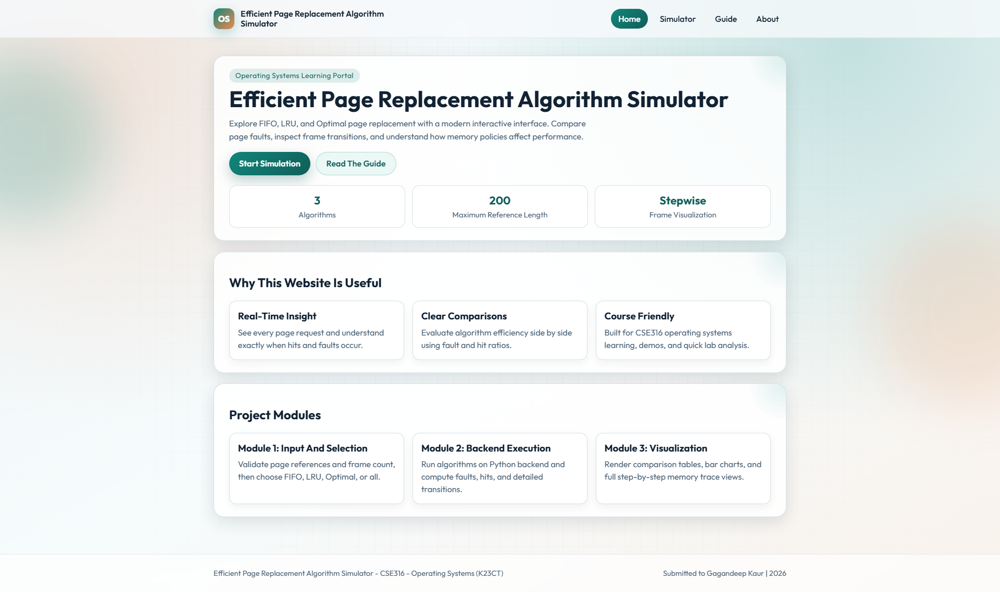
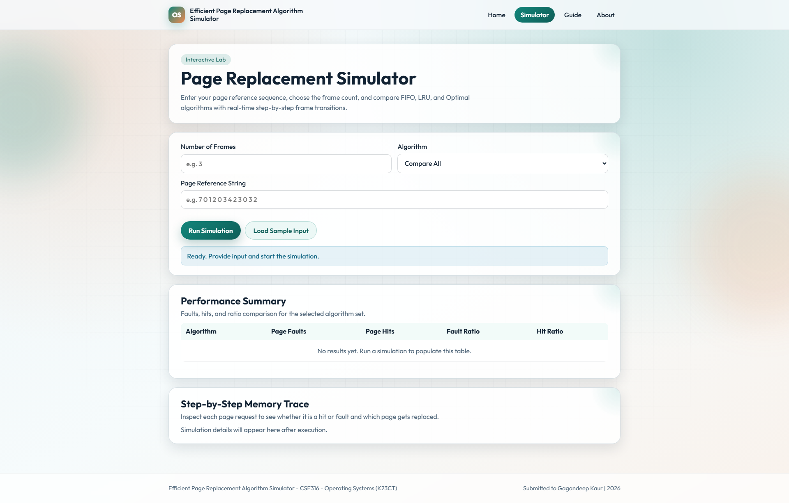
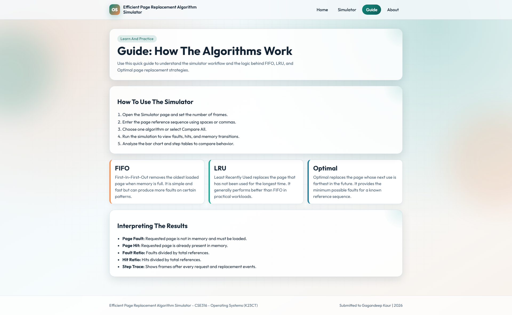
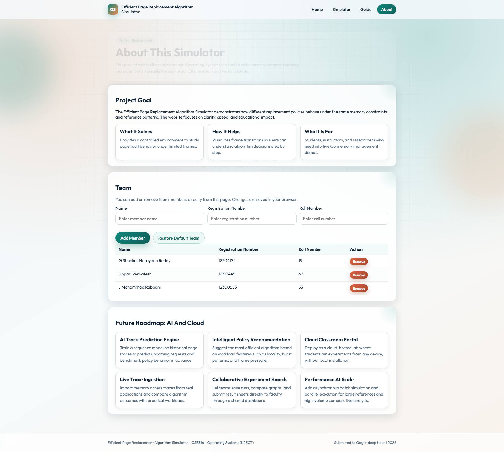

# Efficient Page Replacement Algorithm Simulator

## Repository
GitHub Repository:
https://github.com/Shankar6300/Page-Replacement-Simulator

## Overview
This is a Flask-based, multi-page educational web application for analyzing page replacement algorithms used in Operating Systems.

The simulator includes:
- Modern website design with Home, Simulator, Guide, and About pages.
- Input validation and robust backend API.
- Interactive comparison of FIFO, LRU, and Optimal.
- Step-by-step frame transition visualization.

## Website Sections
- Home: Project introduction and module overview.
- Simulator: Input form, metrics table, visual comparison chart, and full trace output.
- Guide: Algorithm explanation and interpretation help.
- About: Team details and future roadmap.

## Core Features
- Algorithms: FIFO, LRU, Optimal, or Compare All.
- Input validation:
        - Frames range from 1 to 15.
        - Reference input accepts spaces or commas.
        - Maximum 200 page references.
        - Only non-negative integers are allowed.
- Output metrics:
        - Page faults
        - Page hits
        - Fault ratio
        - Hit ratio
- Visualization:
        - Comparison table
        - Fault bar chart
        - Per-step memory trace

## Project Structure
```
app.py
page_replacement_simulator.py
Readme.md
requirements.txt
static/
        script.js
        styles.css
templates/
        base.html
        index.html
        simulator.html
        guide.html
        about.html
screenshots/
        (add images after deployment)
```

## Technologies
- Backend: Python, Flask
- Frontend: HTML, CSS, JavaScript
- Visualization: Native HTML/CSS/JS components

## Run Locally
1. Clone the repository.
2. Move into the project folder.
3. Install dependencies.
4. Start the Flask app.

```bash
git clone https://github.com/Shankar6300/Page-Replacement-Simulator.git
cd Page-Replacement-Simulator
pip install -r requirements.txt
python app.py
```

Open:
http://127.0.0.1:5000/

## Push Local Changes To GitHub
Use these commands from the project root.

If this folder is not a git repo yet:
```bash
git init
git branch -M main
git remote add origin https://github.com/Shankar6300/Page-Replacement-Simulator.git
```

If remote already exists:
```bash
git remote set-url origin https://github.com/Shankar6300/Page-Replacement-Simulator.git
```

Commit and push:
```bash
git add .
git commit -m "Upgrade simulator website, backend, and documentation"
git push -u origin main
```

## Deployment Steps (Render)
1. Push code to GitHub.
2. Login to Render.
3. Click New + and choose Web Service.
4. Connect repository: Shankar6300/Page-Replacement-Simulator.
5. Configure service:
         - Environment: Python
         - Build Command: pip install -r requirements.txt
         - Start Command: python app.py
6. Add environment variable:
         - FLASK_DEBUG = 0
7. Click Deploy Web Service.

After deployment, copy the live URL and add it in the Live Demo section below.

## Live Demo
Add deployed link here after deployment:

Live URL: https://your-live-url-here

## Screenshots
After deployment, take screenshots and place them inside screenshots/ folder, then update paths below.

### Home Page


### Simulator Page


### Guide Page


### About Page


## API
Endpoint:
POST /api/simulate

Sample JSON request:
```json
{
        "frames": 3,
        "pages": "7 0 1 2 0 3 4 2 3 0 3 2",
        "algorithm": "all"
}
```

Response includes:
- Validated input
- Per-algorithm metrics
- Step-by-step memory states

## Sample Output For Common Input
Input:
- Frames: 3
- Pages: 7 0 1 2 0 3 4 2 3 0 3 2

Typical faults:
- FIFO: 8
- LRU: 8
- Optimal: 7

## Future Roadmap
- AI-based trace prediction and policy recommendation.
- Cloud-hosted classroom mode with shared experiment dashboards.
- Real workload trace ingestion.
- Advanced algorithms: Clock, Second-Chance, and MRU.
